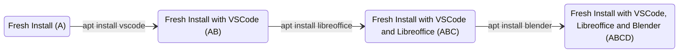
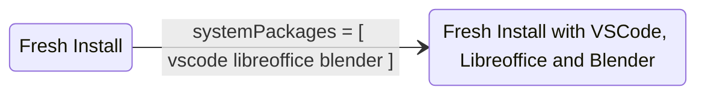

A traditional Linux system is configured by executing a sequence of commands, such as installing packages individually on a fresh system. For example:

```bash
apt install vscode
apt install libreoffice
apt install blender
```

Each command transitions the system to the next state. For instance, a fresh install (A) becomes a fresh install with VSCode (AB) after installing VSCode, and so on.



The problem with this approach is that it creates unnecessary intermediate states (AB and ABC) and depends on the order of actions. There is no guarantee that ABCD and ACBD will be the same state.

What about removing packages? There is no guarantee that DCBA will return to the initial state (A) either!

## NixOS Solves These Issues!

Instead of running a series of commands, NixOS allows you to define exactly what you want your system to be, like writing a list of items for a shopping trip. Nix takes this list and builds the system accordingly.



There is no such thing as order for nix's configuration. The language is purely functional, like haskell.

And finally, removing the packages leads you to the exact state you previously had.

